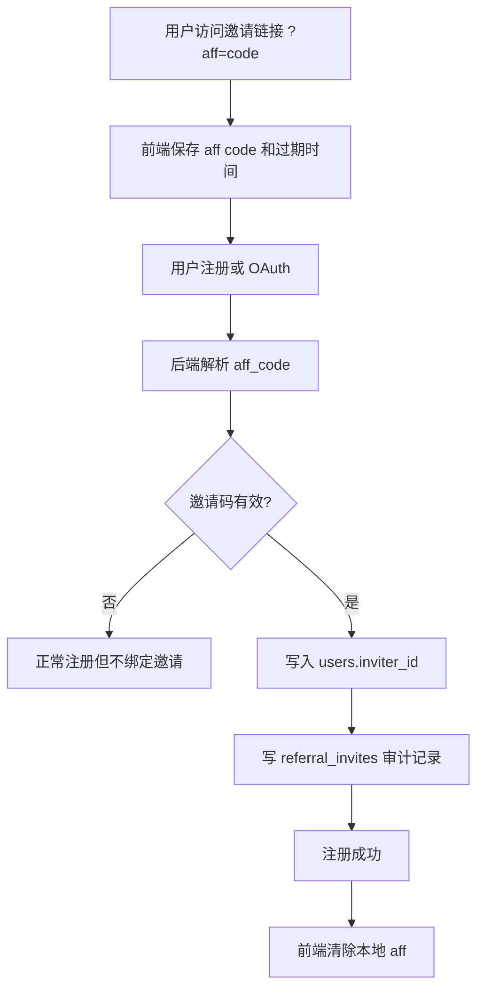
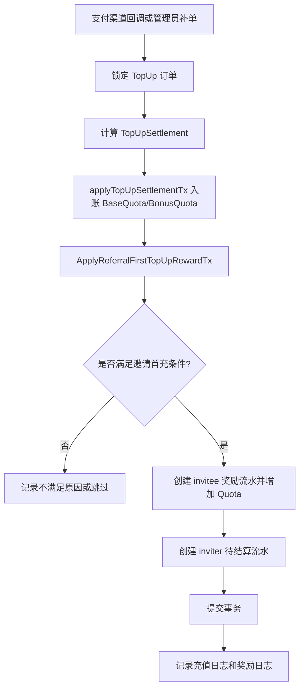

# 邀请首充双向奖励二开方案与风控方案

## 1. 文档信息

| 项目 | 内容 |
| --- | --- |
| 文档名称 | 邀请首充双向奖励二开方案与风控方案 |
| 当前基础 | 现有邀请注册奖励、邀请额度转余额、统一充值订单结算链路 |
| 核心机制 | 被邀请用户首单充值实付金额大于等于 30，邀请双方各获得 10% 奖励 |
| 默认产品口径 | 严格首单、实付金额 >= 30、按基础充值额度计算 10%、被邀请人即时到账、邀请人延迟结算 |
| 涉及端 | 后端模型与结算、管理后台配置、用户钱包/邀请页、支付退款链路、风控与运营报表 |
| 建议优先级 | P0：奖励流水与结算幂等；P1：退款扣回与风控冻结；P2：运营看板与精细化配置 |

---

## 2. 背景与目标

现有邀请功能主要解决“注册关系绑定”和“固定邀请额度奖励”，用户注册时携带邀请码会绑定邀请人，邀请者获得固定邀请额度，之后可通过邀请额度转余额功能完成兑换。

本次二开的目标是把邀请从“拉新注册奖励”升级为“拉新付费奖励”，以首充行为作为有效邀请标准，提升邀请质量和付费转化。

### 2.1 业务目标

1. 提升新用户首充转化率。
2. 提高邀请用户质量，减少单纯薅注册奖励。
3. 让邀请者收益和被邀请用户真实付费绑定。
4. 建立可审计、可退款扣回、可冻结、可统计的邀请奖励体系。
5. 为后续多活动、分层奖励、推广员体系预留扩展空间。

### 2.2 本期目标

实现规则：

> 被邀请用户完成首笔有效充值，且该笔充值实付金额大于等于 30，系统给被邀请用户和邀请者各发放该笔基础充值额度 10% 的奖励。

默认解释：

- “大于等于 30”按实付金额判断：`Money >= 30.00`。
- “首单充值”按被邀请用户第一笔成功的钱包充值判断。
- 奖励基数按该订单实际入账的基础充值额度 `BaseQuota`，不叠加普通充值活动赠送额度。
- 被邀请用户奖励进入普通余额 `Quota`。
- 邀请者奖励先进入待结算，过风控期后进入邀请余额 `AffQuota`。

### 2.3 非目标

本期不做：

1. 多级分销。
2. 现金提现。
3. 邀请排行榜奖金池。
4. 渠道代理佣金结算。
5. 按消耗量持续返佣。
6. 订阅套餐推广佣金。

以上能力可在奖励流水和关系表稳定后追加。

---

## 3. 当前代码现状梳理

### 3.1 用户邀请关系

当前 `User` 已有邀请相关字段：

| 字段 | 含义 |
| --- | --- |
| `AffCode` | 用户自己的邀请码，唯一索引 |
| `AffCount` | 邀请人数计数 |
| `AffQuota` | 邀请剩余额度 |
| `AffHistoryQuota` | 邀请历史额度 |
| `InviterId` | 当前用户的邀请者 ID |

当前普通注册会从请求的 `aff_code` 中解析邀请人，并写入 `InviterId`；OAuth 注册也会在 state 中带上 `aff` 参数后完成绑定。

当前 `inviteUser(inviterId)` 直接增加邀请者的 `AffCount / AffQuota / AffHistoryQuota`，没有独立奖励流水、没有首充状态、没有退款扣回记录。

### 3.2 邀请额度转余额

当前 `TransferAffQuotaToQuota` 支持把邀请额度转入普通余额：

- 有最低转移额度限制。
- 事务内锁定用户并校验 `AffQuota` 是否足够。
- 扣减 `AffQuota`，增加 `Quota`。
- 当前接口已受支付合规确认开关保护。

本次二开建议继续复用该能力，但邀请者首充奖励先进入待结算，风控期后再进入 `AffQuota`。

### 3.3 充值订单与活动赠送

当前 `TopUp` 已有：

| 字段 | 用途 |
| --- | --- |
| `Money` | 实付金额 |
| `Amount` | 用户请求充值数量或金额 |
| `BaseQuota` | 基础充值额度 |
| `BonusAmount` | 普通充值活动赠送金额口径 |
| `BonusQuota` | 普通充值活动赠送额度 |
| `RefundAmount` | 累计退款金额 |
| `RefundQuota` | 累计扣回额度 |
| `PaymentProvider` | 支付提供方 |
| `Status` | 订单状态 |

当前充值成功统一会走 `calculateTopUpSettlement...` 与 `applyTopUpSettlementTx` 一类结算流程。Epay、Stripe、Creem、Waffo、Alipay F2F、Waffo Pancake、管理员补单都已在充值成功时落到 `TopUp` 成功结算上。

本次邀请首充奖励应接入统一结算事务，而不是写在单个支付回调里。

### 3.4 前端邀请码存储

当前前端会把 URL 中的 `aff` 存到 `localStorage`，注册表单和 OAuth state 会读取该值。

当前风险点：

1. `aff` 缺少过期时间。
2. 注册成功后未清理，存在共享浏览器误绑定风险。
3. 多次访问不同邀请链接时缺少覆盖策略。
4. 后端只保存 `InviterId`，缺少绑定来源审计信息。

---

## 4. 产品方案

## 4.1 产品名称

建议命名：

- 后台配置名：邀请首充奖励
- 用户侧名称：好友首充奖励
- 流水活动名：邀请首充双向奖励

---

## 4.2 核心规则

### 4.2.1 参与对象

| 角色 | 定义 |
| --- | --- |
| 邀请者 | 拥有邀请码并成功邀请新用户注册的用户 |
| 被邀请用户 | 注册时绑定了 `InviterId` 的新用户 |
| 有效充值订单 | 钱包充值成功、实付金额满足门槛、订单状态为成功、未被判定为异常的订单 |

### 4.2.2 触发条件

订单同时满足以下条件时触发邀请首充奖励：

1. 被邀请用户存在 `InviterId > 0`。
2. 邀请者账号存在且状态正常。
3. 被邀请用户账号状态正常。
4. 订单是被邀请用户第一笔成功的钱包充值订单。
5. 订单实付金额 `Money >= 30.00`。
6. 订单基础充值额度 `BaseQuota > 0`。
7. 该订单没有生成过邀请首充奖励流水。
8. 支付合规确认已开启。
9. 订单未命中高危风控拦截规则。

### 4.2.3 不触发场景

以下场景不触发奖励：

1. 未绑定邀请关系的用户充值。
2. 被邀请用户第一笔成功钱包充值金额 `< 30.00`。
3. 订阅套餐订单。
4. 兑换码、后台直接加额度、系统补偿、迁移额度。
5. 订单状态为 pending、failed、cancelled、refunded。
6. 基础充值额度为 0 的订单。
7. 邀请者或被邀请者账号被禁用。
8. 邀请关系存在自邀请、批量注册、支付账户复用等高危命中。

### 4.2.4 首单口径

默认采用“严格首单”口径，完全匹配当前需求中的“首单充值大于等于 30”：

| 场景 | 是否触发 |
| --- | --- |
| 第一笔成功充值 50 | 触发 |
| 第一笔成功充值 30 | 不触发 |
| 第一笔成功充值 20，第二笔成功充值 50 | 不触发 |
| 第一笔 pending，第二笔先成功 50 | 触发，按第一笔成功订单算 |
| 第一笔失败，第二笔成功 50 | 触发 |
| 第一笔订阅套餐，第二笔钱包充值 50 | 触发，订阅不计入钱包首充 |

运营如果希望更利于转化，可把配置切换为“首次达标”口径：第一笔充值低于门槛不触发，但后续第一笔达到门槛的充值可触发。该口径适合新用户先小额试用的场景，但成本更高。

本期默认：严格首单。

---

## 4.3 奖励计算

### 4.3.1 计算公式

```text
被邀请用户奖励额度 = floor(TopUp.BaseQuota * invitee_reward_percent / 100)
邀请者奖励额度   = floor(TopUp.BaseQuota * inviter_reward_percent / 100)
```

默认配置：

```text
invitee_reward_percent = 10
inviter_reward_percent = 10
threshold_money        = 30.00
threshold_operator     = >=
```

示例：

| 实付金额 | BaseQuota | 被邀请用户奖励 | 邀请者奖励 | 是否触发 |
| --- | ---: | ---: | ---: | --- |
| 30.00 | 30 单位等值额度 | 3 单位等值额度 | 3 单位等值额度 | 是 |
| 31.00 | 31 单位等值额度 | 3.1 单位等值额度 | 3.1 单位等值额度 | 是 |
| 50.00 | 50 单位等值额度 | 5 单位等值额度 | 5 单位等值额度 | 是 |
| 100.00 | 100 单位等值额度 | 10 单位等值额度 | 10 单位等值额度 | 是 |

项目内部实际额度为 quota 整数，展示时按 `QuotaPerUnit` 转换。

### 4.3.2 与普通充值活动叠加

推荐默认可叠加，但分别计算：

```text
最终到账 = BaseQuota + 普通充值活动 BonusQuota + 邀请首充奖励 InviteeRewardQuota
```

邀请奖励只按 `BaseQuota` 计算，不按 `BaseQuota + BonusQuota` 计算。

可配置策略：

| 策略 | 说明 | 推荐 |
| --- | --- | --- |
| stack | 邀请奖励与充值活动叠加 | 默认推荐 |
| exclusive_max | 邀请奖励与充值活动二选一，取更高者 | 成本保守场景 |
| exclusive_referral | 命中邀请奖励时不参与充值活动 | 大促控成本场景 |

MVP 可先采用 `stack`，保留配置字段，后续再做互斥策略。

### 4.3.3 奖励上限

建议配置三类上限：

| 上限 | 默认值 | 说明 |
| --- | ---: | --- |
| 单笔被邀请用户奖励上限 | 0 | 0 表示不限制 |
| 单笔邀请者奖励上限 | 0 | 0 表示不限制 |
| 单邀请者月奖励上限 | 0 | 防推广者异常集中套利 |
| 全站活动总预算 | 0 | 防止活动成本失控 |

---

## 4.4 到账策略

### 4.4.1 被邀请用户奖励

推荐：支付成功后立即到账到普通余额 `Quota`。

原因：

1. 强化首充即时反馈。
2. 提高新用户继续使用的概率。
3. 被邀请用户自身就是付款方，退款扣回时可从普通余额直接扣。

状态：

```text
created -> settled
```

### 4.4.2 邀请者奖励

推荐：支付成功后进入待结算，默认 7 天后结算到 `AffQuota`。

原因：

1. 覆盖退款、拒付、支付争议窗口。
2. 给风控审核留出时间。
3. 保持与当前“邀请额度可转余额”体系兼容。

状态：

```text
created -> pending -> settled
created -> pending -> blocked -> settled
created -> pending -> cancelled
settled -> reversed
```

### 4.4.3 到账文案

被邀请用户：

```text
好友邀请首充奖励到账：+{quota}
```

邀请者待结算：

```text
好友 {masked_user} 完成首充，你获得 {quota} 邀请奖励，预计 {date} 结算
```

邀请者正式到账：

```text
邀请首充奖励已结算：+{quota}
```

退款扣回：

```text
邀请首充订单发生退款，已按比例扣回奖励：-{quota}
```

---

## 5. 风控方案

## 5.1 风控目标

1. 防止自邀请。
2. 防止同人多账号套利。
3. 防止支付后退款套利。
4. 防止批量注册和批量首充套利。
5. 防止推广者通过异常账号刷奖励。
6. 保证每笔奖励可审计、可冻结、可取消、可扣回。

---

## 5.2 风控分层

### 5.2.1 注册绑定阶段

| 风险 | 规则 | 处理 |
| --- | --- | --- |
| 邀请码无效 | aff_code 查询不到用户 | 不绑定邀请关系 |
| 自邀请 | 注册用户与邀请者身份高度一致 | 绑定后标记风险或拒绝奖励 |
| 邀请码长期残留 | localStorage 中 aff 无过期 | 前端增加 7 天有效期，注册后清除 |
| 共享设备误绑定 | 同浏览器保存旧 aff | 展示“你正在通过 XX 邀请注册”，允许注册前清除 |
| 批量注册 | 同 IP/设备短时间大量注册 | 限流、验证码、风险标记 |

建议落库审计字段：

- `aff_code`
- `inviter_id`
- `invitee_id`
- `bind_ip`
- `bind_user_agent_hash`
- `bind_device_fingerprint`
- `bind_source`
- `bind_time`
- `risk_flags`

### 5.2.2 充值触发阶段

| 风险 | 规则 | 处理 |
| --- | --- | --- |
| 重复回调 | 同一 topup 多次成功回调 | 唯一索引幂等，重复回调跳过 |
| 非钱包充值 | 订阅、兑换码、后台加额度 | 排除 |
| 小额绕规则 | 第一笔成功充值 <= 30 | 记录不满足原因，后续不触发严格首单奖励 |
| 支付金额异常 | Money <= 0 或 BaseQuota <= 0 | 不生成奖励 |
| 支付账户复用 | 同支付账户给多个被邀请账号首充 | 标记风险，邀请者奖励冻结 |

### 5.2.3 结算阶段

| 风险 | 规则 | 处理 |
| --- | --- | --- |
| 退款套利 | 结算前退款 | 取消待结算奖励 |
| 部分退款 | 退款金额小于订单金额 | 按退款比例扣回或减少待结算奖励 |
| 已结算后退款 | 奖励已入账 | 从余额或邀请额度扣回，不足则记欠扣 |
| 高危邀请者 | 单人短期大量首充 | 自动冻结待结算奖励 |
| 预算用尽 | 全站预算达到上限 | 后续奖励进入 cancelled，原因为 budget_exhausted |

### 5.2.4 运营审核阶段

建议管理后台提供以下操作：

| 操作 | 说明 |
| --- | --- |
| 通过 | 风控冻结后人工通过并进入待结算或直接结算 |
| 冻结 | 暂停结算，保留奖励资格 |
| 取消 | 取消奖励资格，记录原因 |
| 补发 | 对误判或异常订单人工补发 |
| 扣回 | 对已结算奖励人工扣回 |

---

## 5.3 风控规则清单

### 5.3.1 P0 必做规则

| 规则编号 | 规则 | 默认动作 |
| --- | --- | --- |
| R001 | invitee_id 与 inviter_id 相同 | 取消奖励 |
| R002 | 同一 topup_id 已存在邀请奖励 | 跳过 |
| R003 | invitee 没有 inviter_id | 跳过 |
| R004 | 首笔成功钱包充值金额 <= 30 | 记录不满足，跳过 |
| R005 | 订单已退款或非成功 | 跳过 |
| R006 | 订单 BaseQuota <= 0 | 跳过 |
| R007 | 支付合规未确认 | 跳过 |
| R008 | 邀请者或被邀请者账号 disabled/deleted | 取消奖励 |
| R009 | 退款发生时存在奖励流水 | 按比例取消或扣回 |

### 5.3.2 P1 推荐规则

| 规则编号 | 规则 | 默认动作 |
| --- | --- | --- |
| R101 | 同 IP 24 小时注册超过 N 个被邀请账号 | 邀请者奖励冻结 |
| R102 | 同设备指纹 7 天内绑定多个被邀请账号 | 邀请者奖励冻结 |
| R103 | 同支付账户绑定多个 invitee 首充 | 邀请者奖励冻结 |
| R104 | 邀请者 24 小时产生首充奖励超过 N 笔 | 新奖励冻结 |
| R105 | 邀请者 30 天退款率超过阈值 | 后续奖励冻结 |
| R106 | invitee 注册到首充间隔过短，例如 < 60 秒 | 冻结 |
| R107 | invitee 首充后短时间发起退款 | 取消或扣回 |

### 5.3.3 P2 增强规则

| 规则编号 | 规则 | 默认动作 |
| --- | --- | --- |
| R201 | 邀请关系与支付国家/地区异常不一致 | 冻结 |
| R202 | 设备、IP、支付账户形成团伙图谱 | 冻结并进入人工审核 |
| R203 | 邀请者转化率异常高但留存/消耗极低 | 限制活动资格 |
| R204 | 被邀请用户首充后无任何正常 API 消耗 | 标记低质量 |
| R205 | 邀请者收益超过充值贡献 ROI 阈值 | 降权或暂停奖励 |

---

## 5.4 风险状态设计

建议奖励流水同时有业务状态和风险状态。

### 5.4.1 业务状态

| 状态 | 含义 |
| --- | --- |
| `pending` | 待结算 |
| `settled` | 已结算到账 |
| `cancelled` | 已取消 |
| `reversed` | 已扣回 |
| `partial_reversed` | 部分扣回 |

### 5.4.2 风险状态

| 状态 | 含义 |
| --- | --- |
| `normal` | 正常 |
| `review` | 待人工审核 |
| `blocked` | 风控冻结 |
| `approved` | 人工通过 |
| `rejected` | 人工驳回 |

### 5.4.3 状态组合建议

| 业务状态 | 风险状态 | 是否可结算 |
| --- | --- | --- |
| pending | normal | 到期可结算 |
| pending | review | 待审核后结算 |
| pending | blocked | 暂停结算 |
| pending | approved | 可结算 |
| cancelled | rejected | 不结算 |
| settled | normal | 已完成 |
| settled | blocked | 后续退款或审查可扣回 |

---

## 6. 技术方案

## 6.1 总体设计原则

1. 邀请奖励必须有独立流水表。
2. 所有支付渠道成功结算后统一触发奖励判断。
3. 奖励发放与订单成功结算尽量在同一数据库事务内完成。
4. 通过唯一索引保证幂等。
5. 退款链路同步处理邀请奖励扣回。
6. 风控规则先以同步硬规则为主，复杂规则后续异步扫描。
7. 保持 SQLite、MySQL、PostgreSQL 三库兼容。
8. JSON 读写使用项目 `common` 包封装。

---

## 6.2 新增配置

建议在 `operation_setting.PaymentSetting` 下新增：

```go
type ReferralFirstTopUpRewardSetting struct {
    Enabled                    bool     `json:"enabled"`
    ActivityID                 string   `json:"activity_id"`
    ActivityName               string   `json:"activity_name"`
    StartTime                  int64    `json:"start_time"`
    EndTime                    int64    `json:"end_time"`
    MinPaidMoney               float64  `json:"min_paid_money"`
    ThresholdOperator          string   `json:"threshold_operator"` // gte 或 gt，默认 gte
    FirstTopUpMode             string   `json:"first_topup_mode"`    // strict_first 或 first_qualified
    InviteeRewardPercent       float64  `json:"invitee_reward_percent"`
    InviterRewardPercent       float64  `json:"inviter_reward_percent"`
    InviterSettleDelayDays     int      `json:"inviter_settle_delay_days"`
    SingleInviteeRewardMaxQuota int     `json:"single_invitee_reward_max_quota"`
    SingleInviterRewardMaxQuota int     `json:"single_inviter_reward_max_quota"`
    InviterMonthlyMaxQuota     int      `json:"inviter_monthly_max_quota"`
    TotalBudgetQuota           int      `json:"total_budget_quota"`
    StackWithTopUpBonus        bool     `json:"stack_with_topup_bonus"`
    ExcludedPaymentProviders   []string `json:"excluded_payment_providers"`
    ExcludedUserGroups         []string `json:"excluded_user_groups"`
    AutoBlockRiskyRewards      bool     `json:"auto_block_risky_rewards"`
    Visible                    bool     `json:"visible"`
}
```

默认值建议：

```json
{
  "enabled": false,
  "activity_id": "referral_first_topup_v1",
  "activity_name": "邀请首充双向奖励",
  "min_paid_money": 30,
  "threshold_operator": "gte",
  "first_topup_mode": "strict_first",
  "invitee_reward_percent": 10,
  "inviter_reward_percent": 10,
  "inviter_settle_delay_days": 7,
  "stack_with_topup_bonus": true,
  "auto_block_risky_rewards": true,
  "visible": true
}
```

配置入口：

- 管理后台：系统设置 -> 计费设置 -> 邀请首充奖励。
- 用户钱包接口：`/api/user/topup/info` 返回活动可见配置，用于充值页提示。

---

## 6.3 新增表结构

### 6.3.1 邀请关系审计表 `referral_invites`

用途：保留注册时的邀请绑定证据，解决仅靠 `users.inviter_id` 审计不足的问题。

| 字段 | 类型建议 | 说明 |
| --- | --- | --- |
| `id` | int | 主键 |
| `inviter_id` | int | 邀请者用户 ID |
| `invitee_id` | int | 被邀请用户 ID，唯一索引 |
| `aff_code` | varchar(32) | 注册使用的邀请码 |
| `source` | varchar(32) | register / oauth |
| `bind_ip` | varchar(64) | 注册 IP |
| `user_agent_hash` | varchar(128) | UA 哈希 |
| `device_fingerprint` | varchar(128) | 设备指纹，后续可选 |
| `risk_flags` | text | JSON 数组 |
| `created_at` | int64 | 创建时间 |
| `updated_at` | int64 | 更新时间 |

索引：

```text
unique(invitee_id)
index(inviter_id)
index(aff_code)
index(created_at)
```

### 6.3.2 邀请奖励流水表 `referral_rewards`

用途：记录每一笔邀请奖励从创建、待结算、到账、取消、扣回的完整生命周期。

| 字段 | 类型建议 | 说明 |
| --- | --- | --- |
| `id` | int | 主键 |
| `activity_id` | varchar(128) | 活动 ID |
| `activity_name` | varchar(255) | 活动名称 |
| `reward_role` | varchar(32) | invitee / inviter |
| `inviter_id` | int | 邀请者 ID |
| `invitee_id` | int | 被邀请用户 ID |
| `topup_id` | int | 充值订单 ID |
| `trade_no` | varchar(255) | 充值订单号 |
| `payment_provider` | varchar(50) | 支付渠道 |
| `paid_money` | decimal string 或 float64 | 实付金额快照 |
| `base_quota` | int | 奖励计算基数 |
| `reward_percent` | float64 | 奖励比例快照 |
| `reward_quota` | int | 原始奖励额度 |
| `settled_quota` | int | 已结算额度 |
| `reversed_quota` | int | 已扣回额度 |
| `refund_amount` | float64 | 已关联退款金额 |
| `status` | varchar(32) | pending / settled / cancelled / reversed / partial_reversed |
| `risk_status` | varchar(32) | normal / review / blocked / approved / rejected |
| `risk_reason` | varchar(255) | 风险原因 |
| `risk_snapshot` | text | JSON 快照 |
| `settle_at` | int64 | 预计结算时间 |
| `settled_at` | int64 | 实际结算时间 |
| `cancelled_at` | int64 | 取消时间 |
| `reversed_at` | int64 | 最近扣回时间 |
| `created_at` | int64 | 创建时间 |
| `updated_at` | int64 | 更新时间 |

唯一索引：

```text
unique(topup_id, reward_role)
```

常用索引：

```text
index(inviter_id, status)
index(invitee_id, status)
index(trade_no)
index(status, risk_status, settle_at)
index(created_at)
```

说明：每个有效订单最多生成两条奖励流水：

1. `reward_role = invitee`：给被邀请用户。
2. `reward_role = inviter`：给邀请者。

两条流水状态可以不同：被邀请用户通常立即 `settled`，邀请者通常先 `pending`。

---

## 6.4 后端核心流程

### 6.4.1 注册绑定流程



关键要求：

1. 邀请关系绑定后不随前端 localStorage 变化而改变。
2. 同一 `invitee_id` 只允许一条邀请关系。
3. 管理员可查看绑定证据。
4. 注册成功后清除本地 `aff`。
5. `aff` 本地保存 7 天过期。

### 6.4.2 充值成功奖励判断流程



建议入口：

```go
func applyTopUpSettlementTx(tx *gorm.DB, topUp *TopUp, settlement TopUpSettlement, extraUserUpdates map[string]interface{}) error {
    // 原有充值成功入账
    // ...

    // 新增：统一触发邀请首充奖励
    return applyReferralFirstTopUpRewardTx(tx, topUp, settlement)
}
```

注意：订阅订单的 `upsertSubscriptionTopUpTx` 当前只是镜像收入统计，不经过 `applyTopUpSettlementTx`，默认不触发邀请首充奖励。后续若订阅也要返佣，应单独做订阅推广方案。

### 6.4.3 奖励资格判断伪代码

```go
func applyReferralFirstTopUpRewardTx(tx *gorm.DB, topUp *TopUp, settlement TopUpSettlement) error {
    cfg := operation_setting.GetPaymentSetting().ReferralFirstTopUpReward
    if !cfg.Enabled || !operation_setting.IsPaymentComplianceConfirmed() {
        return nil
    }
    if topUp == nil || topUp.Status != common.TopUpStatusSuccess {
        return nil
    }
    if settlement.BaseQuota <= 0 || topUp.Money <= 0 {
        return nil
    }
    if !paidMoneyPassesThreshold(topUp.Money, cfg.MinPaidMoney, cfg.ThresholdOperator) {
        return markFirstTopUpEvaluatedIfNeeded(tx, topUp, "below_threshold")
    }
    if isExcludedProvider(cfg, topUp.PaymentProvider) {
        return nil
    }

    invitee, inviter, ok := loadReferralUsersForReward(tx, topUp.UserId)
    if !ok {
        return nil
    }
    if invitee.Id == inviter.Id {
        return createCancelledReferralRewards(tx, topUp, "self_invite")
    }
    if !isWalletFirstSuccessfulTopUp(tx, invitee.Id, topUp.Id, cfg.FirstTopUpMode) {
        return nil
    }

    risk := evaluateReferralRisk(tx, inviter, invitee, topUp)
    inviteeQuota := calculateReferralRewardQuota(settlement.BaseQuota, cfg.InviteeRewardPercent, cfg.SingleInviteeRewardMaxQuota)
    inviterQuota := calculateReferralRewardQuota(settlement.BaseQuota, cfg.InviterRewardPercent, cfg.SingleInviterRewardMaxQuota)

    if inviteeQuota > 0 {
        createAndSettleInviteeReward(tx, invitee.Id, inviter.Id, topUp, inviteeQuota, risk)
    }
    if inviterQuota > 0 {
        createPendingInviterReward(tx, inviter.Id, invitee.Id, topUp, inviterQuota, risk)
    }
    return nil
}
```

### 6.4.4 首充判断

严格首单模式：

```text
查询 invitee 所有成功钱包充值订单，按 complete_time/id 升序，第一条必须是当前 topup。
```

过滤条件：

- `status = success`
- `base_quota > 0` 或 `amount > 0`
- 排除订阅镜像订单
- 排除管理员纯补偿订单

建议不要简单使用 `TopUp.status = success` 计数，因为订阅购买也可能产生收入统计镜像，且某些订单 `Amount = 0`。

---

## 6.5 邀请者延迟结算任务

新增定时任务或后台 job：

```text
每 5-10 分钟扫描 referral_rewards
条件：status = pending AND risk_status IN (normal, approved) AND settle_at <= now
动作：锁定奖励流水和邀请者用户 -> 增加 inviter.aff_quota / aff_history_quota -> status = settled
```

结算事务要求：

1. `lockForUpdate(tx)` 锁定奖励流水。
2. `lockForUpdate(tx)` 锁定邀请者用户。
3. 检查奖励仍为 pending。
4. 检查订单未全额退款。
5. 更新 `AffQuota` 和 `AffHistoryQuota`。
6. 更新 `ReferralReward.status = settled`。
7. 记录系统日志。

---

## 6.6 退款扣回流程

当前退款链路已按比例扣回充值基础额度和普通充值活动赠送。本次要追加邀请奖励扣回。

### 6.6.1 退款扣回规则

```text
退款比例 = 本次实际退款金额 / 原订单实付金额
本次应扣邀请奖励 = floor(原奖励额度 * 退款比例) - 已扣回额度差额
```

### 6.6.2 不同状态处理

| 奖励状态 | 退款处理 |
| --- | --- |
| invitee settled | 从被邀请用户 Quota 扣回对应奖励 |
| inviter pending | 减少或取消待结算奖励 |
| inviter settled | 从邀请者 AffQuota 优先扣回，不足再从 Quota 或记录欠扣 |
| cancelled | 跳过 |
| reversed | 跳过 |

### 6.6.3 扣回优先级

邀请者已结算奖励推荐扣回顺序：

1. `AffQuota`。
2. `Quota`。
3. 欠扣记录 `reward_debt_quota`，后续邀请奖励或充值后优先扣。

被邀请用户奖励扣回顺序：

1. `Quota`。
2. 欠扣记录。

MVP 可先采用“余额不足则退款处理返回错误并告警”的策略，但推荐同时设计欠扣能力，避免支付平台退款已成功而站内扣回卡住。

---

## 6.7 管理后台功能

### 6.7.1 配置页

位置：系统设置 -> 计费设置 -> 邀请首充奖励。

字段：

1. 是否启用。
2. 活动 ID。
3. 活动名称。
4. 活动开始时间。
5. 活动结束时间。
6. 首充门槛金额。
7. 门槛运算符：大于等于 / 大于。
8. 首充口径：严格首单 / 首次达标。
9. 被邀请用户奖励比例。
10. 邀请者奖励比例。
11. 邀请者结算延迟天数。
12. 单笔奖励上限。
13. 月度奖励上限。
14. 全站预算。
15. 是否与普通充值活动叠加。
16. 排除支付渠道。
17. 排除用户组。
18. 风险自动冻结。

### 6.7.2 奖励流水列表

筛选项：

- 邀请者 ID。
- 被邀请用户 ID。
- 订单号。
- 支付渠道。
- 业务状态。
- 风险状态。
- 时间范围。
- 活动 ID。

列表字段：

- 奖励 ID。
- 邀请者。
- 被邀请用户。
- 订单号。
- 实付金额。
- 基础额度。
- 奖励比例。
- 奖励额度。
- 已结算额度。
- 已扣回额度。
- 状态。
- 风险状态。
- 预计结算时间。
- 创建时间。

操作：

- 查看详情。
- 通过审核。
- 冻结。
- 取消。
- 补发。
- 扣回。

### 6.7.3 管理员邀请统计页面

新增独立管理页：`邀请统计`。

建议路由与侧边栏：

| 项目 | 设计 |
| --- | --- |
| 页面名称 | 邀请统计 |
| 前端路由 | `/referrals` 或 `/referral-stats`，推荐 `/referrals` |
| 所属侧边栏分组 | `Admin` |
| 建议位置 | 放在 `Users` 后、`Redemption Codes` 前，符合“用户 -> 邀请 -> 兑换码/订阅”的管理路径 |
| 图标 | `Handshake`、`Share2` 或 `UsersRound`，优先 `Handshake` |
| 角色权限 | 管理员可见；如区分权限，建议仅 `SUPER_ADMIN` 可做人工扣回/补发，普通管理员只读或审核 |
| 侧边栏模块键 | `admin.referral` |

前端接入点建议：

| 文件 | 改动 |
| --- | --- |
| `web/default/src/hooks/use-sidebar-data.ts` | Admin 导航新增 `Referral Stats` / `/referrals` |
| `web/default/src/hooks/use-sidebar-config.ts` | `DEFAULT_SIDEBAR_MODULES.admin.referral = true`，`URL_TO_CONFIG_MAP['/referrals'] = { section: 'admin', module: 'referral' }` |
| `web/default/src/routes/_authenticated/referrals/index.tsx` | 新增 TanStack Router 页面路由 |
| `web/default/src/features/referrals/` | 新增页面、API、类型、表格、筛选组件 |
| `web/default/src/i18n/static-keys.ts` 与六语言 locale | 新增页面标题、筛选项、统计卡片、操作文案 |

页面目标：让管理员一眼看清“邀请送了多少钱、带来多少充值、有没有亏、谁在异常薅奖励”。

### 6.7.3.1 页面信息架构

页面分为 6 个区块：

1. 顶部筛选区。
2. 核心统计卡片。
3. 邀请转化漏斗。
4. 奖励成本与充值收入趋势。
5. 邀请者排行榜。
6. 奖励流水与风控队列。

### 6.7.3.2 顶部筛选区

筛选项：

| 筛选 | 说明 |
| --- | --- |
| 时间范围 | 今天、昨天、近 7 天、近 30 天、本月、上月、自定义 |
| 活动 ID | 支持不同邀请活动版本筛选 |
| 邀请者 ID / 用户名 | 定位单个推广用户 |
| 被邀请用户 ID / 用户名 | 定位单个被邀请用户 |
| 支付渠道 | Epay、Stripe、Creem、Waffo、Alipay F2F、Waffo Pancake |
| 奖励状态 | pending、settled、cancelled、reversed、partial_reversed |
| 风险状态 | normal、review、blocked、approved、rejected |
| 用户组 | 排查不同用户组质量 |
| 是否退款 | 全部、未退款、部分退款、全额退款 |

默认筛选：近 30 天，全活动，全状态。

### 6.7.3.3 核心统计卡片

第一行展示经营结果：

| 卡片 | 指标口径 | 价值 |
| --- | --- | --- |
| 邀请注册数 | 绑定邀请关系的新用户数 | 看拉新规模 |
| 达标首充人数 | 首笔钱包充值实付金额 >= 30 的被邀请用户数 | 看有效转化 |
| 邀请首充实付金额 | 达标首充订单 `Money - RefundAmount` | 看收入贡献 |
| 已送奖励 | 已结算给 invitee + inviter 的奖励额度，按展示货币换算 | 回答“送了多少钱” |
| 待结算奖励 | pending 且未取消的邀请者奖励 | 看未来成本敞口 |
| 已扣回奖励 | reversed + partial_reversed 的奖励额度 | 看退款/风控影响 |

第二行展示效率与风险：

| 卡片 | 指标口径 | 价值 |
| --- | --- | --- |
| 首充转化率 | 达标首充人数 / 邀请注册数 | 看邀请质量 |
| 奖励成本率 | 总奖励额度 / 邀请首充基础额度 | 看活动成本 |
| ROI | 邀请首充净实付金额 / 总奖励成本 | 看是否值得继续投放 |
| 退款金额 | 达标首充订单累计退款金额 | 看退款风险 |
| 退款率 | 退款订单数 / 达标首充订单数 | 看活动健康度 |
| 风控冻结数 | risk_status=blocked/review 的奖励数 | 看异常规模 |

“已送奖励”建议拆分 tooltip：

```text
已送奖励 = 被邀请人已到账奖励 + 邀请者已结算奖励
不包含 pending 待结算奖励
不包含已扣回部分
```

### 6.7.3.4 邀请转化漏斗

漏斗节点：

```text
邀请链接访问 -> 注册绑定 -> 首次充值 -> 首充达标 >=30 -> 奖励生成 -> 邀请者结算
```

每个节点展示：

- 人数。
- 转化率。
- 较上一周期变化。

MVP 如果暂不做链接点击埋点，可从“注册绑定”作为第一个漏斗节点；链接访问量作为 P2 埋点能力。

### 6.7.3.5 趋势图

建议使用双轴趋势：

| 曲线 | 说明 |
| --- | --- |
| 邀请首充净实付金额 | 收入贡献 |
| 奖励成本 | invitee settled + inviter settled + pending |
| 达标首充人数 | 转化规模 |
| 退款金额 | 风险趋势 |

支持按日、周、月聚合。

### 6.7.3.6 邀请者排行榜

表格字段：

| 字段 | 说明 |
| --- | --- |
| 邀请者 ID / 用户名 | 推广用户 |
| 邀请注册数 | 绑定邀请关系人数 |
| 达标首充人数 | 有效付费人数 |
| 首充净实付金额 | 被邀请用户首充贡献 |
| 已结算奖励 | 已真正送出的邀请者奖励 |
| 待结算奖励 | 未来可能结算成本 |
| 被邀请人奖励 | 发给被邀请用户的总奖励 |
| 退款金额 / 退款率 | 质量风险 |
| ROI | 净实付金额 / 总奖励成本 |
| 风险状态 | 正常 / 观察 / 冻结 |
| 操作 | 查看明细、冻结待结算、导出 |

排序默认按 `首充净实付金额 desc`，支持切换为 `已结算奖励 desc`、`ROI asc`、`退款率 desc` 用于查风险。

### 6.7.3.7 奖励流水与风控队列

页面下半部分保留两个 Tab：

1. `奖励流水`：展示所有 reward 明细。
2. `风控队列`：默认只展示 `risk_status in (review, blocked)` 或退款异常记录。

奖励流水列：

- 奖励 ID。
- 活动 ID。
- 角色：邀请者 / 被邀请人。
- 邀请者。
- 被邀请用户。
- 订单号。
- 实付金额。
- 基础额度。
- 奖励比例。
- 原始奖励。
- 已结算。
- 已扣回。
- 业务状态。
- 风控状态。
- 预计结算时间。
- 创建时间。
- 操作。

风控队列列：

- 风险等级。
- 命中规则。
- 邀请者近期邀请数。
- 同 IP 注册数。
- 同设备注册数。
- 同支付账户首充数。
- 退款率。
- 冻结金额。
- 处理人。
- 处理备注。

### 6.7.3.8 页面操作

| 操作 | 作用 | 权限建议 |
| --- | --- | --- |
| 查看明细 | 打开奖励详情抽屉 | 管理员 |
| 冻结待结算 | 将 pending 奖励 risk_status 改为 blocked | 管理员 |
| 审核通过 | blocked/review 改为 approved | 管理员 |
| 取消奖励 | pending 奖励改为 cancelled | 管理员 |
| 人工扣回 | 对 settled 奖励发起 reverse | 超级管理员 |
| 导出 CSV | 导出当前筛选结果 | 管理员 |

所有写操作必须记录系统日志，包含操作者 ID、IP、原因、前后状态、奖励 ID。

### 6.7.3.9 API 设计补充

统计页建议新增聚合接口，避免前端拉全量流水自行计算：

| API | 用途 |
| --- | --- |
| `GET /api/admin/referral/stats/summary` | 核心统计卡片 |
| `GET /api/admin/referral/stats/funnel` | 转化漏斗 |
| `GET /api/admin/referral/stats/trend` | 趋势图 |
| `GET /api/admin/referral/stats/top-inviters` | 邀请者排行榜 |
| `GET /api/admin/referral/rewards` | 奖励流水 |
| `GET /api/admin/referral/risk-rewards` | 风控队列，可复用 rewards 筛选 |

`summary` 返回建议：

```json
{
  "invite_registered_count": 120,
  "qualified_first_topup_count": 48,
  "qualified_first_topup_net_money": 3680.5,
  "invitee_settled_reward_quota": 1800000,
  "inviter_settled_reward_quota": 1600000,
  "pending_reward_quota": 420000,
  "reversed_reward_quota": 120000,
  "refund_money": 300,
  "conversion_rate": 0.4,
  "reward_cost_rate": 0.2,
  "roi": 5.8,
  "blocked_reward_count": 6
}
```

### 6.7.3.10 UI 组件建议

基于当前 `web/default` 的 shadcn/Base UI 风格：

- 顶部用 `Card` + `Select` + `DateRangePicker` + `Input` 组成筛选栏。
- 指标用响应式 `Card` 网格，桌面 6 列、平板 3 列、手机 1 列。
- 漏斗和趋势图沿用 dashboard 图表风格。
- 明细使用现有 DataTable 体系，移动端提供卡片列表。
- 风险状态用 Badge：normal 灰/绿、review 黄、blocked 红、approved 绿、rejected 灰。
- 金额展示统一走现有 quota/currency formatter，避免 quota、美元、人民币、tokens 口径混乱。


### 6.7.4 风控详情

展示：

- 注册 IP。
- 充值 IP。
- 设备指纹。
- 支付账户标识哈希。
- 邀请者近期邀请数。
- 邀请者近期退款率。
- 同 IP 注册数量。
- 同设备注册数量。
- 命中的风险规则。

---

## 6.8 用户侧改造

### 6.8.1 邀请页

新增模块：

- 我的邀请码。
- 邀请链接。
- 总邀请人数。
- 有效首充人数。
- 待结算奖励。
- 已到账奖励。
- 已扣回奖励。
- 活动规则说明。

推荐文案：

```text
邀请好友注册并完成首笔实付金额大于等于 30 的充值，你和好友都可获得该笔基础充值额度 10% 的奖励。好友奖励即时到账，你的奖励将在风控期后结算到邀请额度。
```

### 6.8.2 注册页

当 URL 存在 `aff`：

1. 保存邀请码和过期时间。
2. 展示“你正在通过好友邀请注册”。
3. 注册成功后清理 `aff`。
4. 如果用户手动切换邀请链接，以最近一次有效链接为准，并记录覆盖时间。

### 6.8.3 充值页

如果当前用户有邀请者且尚未完成首笔成功钱包充值：

```text
首单实付金额大于等于 30，可额外获得 10% 好友邀请奖励。
```

当选择金额不足：

```text
当前金额未达到邀请奖励门槛，充值满 30 可获得额外 10% 奖励。
```

订单成功后：

```text
充值成功，好友邀请首充奖励已到账：+{quota}
```

### 6.8.4 钱包流水

新增流水类型：

- `referral_first_topup_invitee_reward`
- `referral_first_topup_inviter_reward_pending`
- `referral_first_topup_inviter_reward_settled`
- `referral_first_topup_reward_reversed`

---

## 7. 统计与运营看板

### 7.1 核心指标

| 指标 | 说明 |
| --- | --- |
| 邀请链接点击数 | 邀请活动曝光效果 |
| 邀请注册数 | 通过邀请码注册的用户数 |
| 首充人数 | 被邀请用户完成首充人数 |
| 首充达标人数 | 首单实付金额大于等于 30 的人数 |
| 首充转化率 | 首充人数 / 邀请注册数 |
| 达标首充转化率 | 首充达标人数 / 邀请注册数 |
| 邀请奖励成本 | 已结算奖励 + 待结算奖励 |
| 净充值金额 | 实付金额 - 退款金额 |
| ROI | 被邀请用户净充值金额 / 邀请奖励成本 |
| 退款率 | 被邀请用户退款订单数 / 达标首充订单数 |
| 风控冻结率 | 冻结奖励数 / 生成奖励数 |

### 7.2 邀请者维度

| 指标 | 用途 |
| --- | --- |
| 邀请注册数 | 拉新能力 |
| 有效首充数 | 拉新质量 |
| 总奖励 | 成本 |
| 待结算奖励 | 风险敞口 |
| 退款订单数 | 风险 |
| ROI | 推广质量 |
| 被邀请用户 7 日消耗 | 用户质量 |

### 7.3 被邀请用户维度

| 指标 | 用途 |
| --- | --- |
| 注册到首充耗时 | 转化效率 |
| 首充金额 | 价值 |
| 是否命中奖励 | 活动参与 |
| 7 日留存 | 质量 |
| 7 日消耗额度 | 真实使用 |
| 退款状态 | 风险 |

---

## 8. API 建议

### 8.1 用户侧

#### GET `/api/user/referral/summary`

返回：

```json
{
  "aff_code": "abcd",
  "aff_link": "https://example.com/sign-up?aff=abcd",
  "invite_count": 12,
  "qualified_first_topup_count": 5,
  "pending_reward_quota": 100000,
  "settled_reward_quota": 300000,
  "reversed_reward_quota": 20000
}
```

#### GET `/api/user/referral/rewards`

查询用户自己的邀请奖励记录。

#### GET `/api/user/referral/activity`

返回当前活动可见配置，用于邀请页和充值页展示。

### 8.2 管理侧

#### GET `/api/admin/referral/rewards`

奖励流水列表。

#### POST `/api/admin/referral/rewards/:id/approve`

审核通过。

#### POST `/api/admin/referral/rewards/:id/block`

冻结。

#### POST `/api/admin/referral/rewards/:id/cancel`

取消。

#### POST `/api/admin/referral/rewards/:id/reverse`

人工扣回。

#### GET `/api/admin/referral/stats`

活动统计与 ROI 汇总；MVP 可先提供该聚合接口，后续拆分为 summary/funnel/trend/top-inviters。

#### GET `/api/admin/referral/stats/summary`

邀请注册数、达标首充人数、首充净实付金额、已送奖励、待结算奖励、已扣回奖励、ROI、退款率等核心卡片。

#### GET `/api/admin/referral/stats/funnel`

邀请注册 -> 首次充值 -> 首充达标 >=30 -> 奖励生成 -> 邀请者结算的漏斗数据。

#### GET `/api/admin/referral/stats/trend`

按日/周/月返回邀请首充净实付金额、奖励成本、达标首充人数、退款金额趋势。

#### GET `/api/admin/referral/stats/top-inviters`

邀请者排行榜，包含邀请注册数、达标首充数、首充净实付、已结算奖励、待结算奖励、退款率、ROI。

---

## 9. 实施计划

## 9.1 P0：MVP 必做

1. 新增邀请首充奖励配置结构。
2. 新增 `ReferralInvite` 审计模型。
3. 新增 `ReferralReward` 奖励流水模型。
4. 注册和 OAuth 创建用户后写入邀请关系审计。
5. 前端 `aff` 增加过期时间和注册成功清理。
6. 在统一充值成功结算事务中接入奖励判断。
7. 被邀请用户奖励即时入账。
8. 邀请者奖励生成待结算流水。
9. 新增邀请者延迟结算任务。
10. 退款链路处理奖励取消或扣回。
11. 管理员侧边栏新增 `邀请统计` 页面入口。
12. 管理员邀请统计页展示已送奖励、待结算奖励、首充收入、ROI、退款率和邀请者排行。
13. 基础后台列表与人工冻结/取消/通过。
14. 单元测试覆盖成功、低于门槛、重复回调、退款扣回。

## 9.2 P1：风控增强

1. IP / UA / 设备指纹风险快照。
2. 支付账户复用风险标记。
3. 邀请者日/月奖励上限。
4. 全站预算控制。
5. 风险冻结队列。
6. 邀请页统计。
7. 管理员邀请统计趋势图、漏斗、风控队列。
8. 用户奖励明细。

## 9.3 P2：运营优化

1. 邀请活动 ROI 看板。
2. 邀请者质量分。
3. 推广员分层奖励。
4. 活动 A/B 规则。
5. 邀请链接点击归因。
6. 站内通知和邮件通知。

---

## 10. 测试方案

### 10.1 后端单元测试

| 测试 | 预期 |
| --- | --- |
| 被邀请用户首单实付 50 | 生成两条奖励，invitee 已到账，inviter pending |
| 被邀请用户首单实付 30 | 不生成奖励 |
| 被邀请用户首单实付 20 后再充 50 | 严格首单模式不生成奖励 |
| 重复支付回调 | 奖励只生成一次 |
| 无 inviter_id 用户充值 | 不生成奖励 |
| 邀请者账号 disabled | 奖励 cancelled |
| BaseQuota 为 0 | 不生成奖励 |
| 退款发生在 inviter pending 前 | pending 奖励取消或减少 |
| 退款发生在 inviter settled 后 | 按比例扣回 |
| 部分退款重复回调 | 只按新增退款差额扣回 |
| 全额退款 | 奖励全部 reversed/cancelled |
| 预算耗尽 | 新奖励 cancelled |

### 10.2 集成测试

覆盖支付入口：

1. Epay 成功回调。
2. Stripe payment intent 成功。
3. Creem 成功回调。
4. Waffo 成功回调。
5. Alipay F2F 成功查询/回调。
6. Waffo Pancake 钱包充值成功。
7. 管理员补单。
8. 订阅订单成功但不触发邀请奖励。

### 10.3 前端测试

1. 邀请链接进入注册页后保存 aff。
2. aff 超过 7 天失效。
3. 注册成功后清除 aff。
4. OAuth state 携带有效 aff。
5. 充值页根据门槛展示奖励提示。
6. 邀请页展示待结算、已到账、已扣回。
7. 管理员侧边栏可进入邀请统计页，并能看到“邀请送了多少钱”、ROI、退款率、待结算敞口。

### 10.4 风控测试

1. 同 IP 批量注册触发冻结。
2. 同支付账户多账号首充触发冻结。
3. 邀请者高退款率触发冻结。
4. 人工审核通过后正常结算。
5. 人工取消后不结算。

---

## 11. 上线与迁移方案

### 11.1 数据迁移

1. 新增 `referral_invites` 表。
2. 新增 `referral_rewards` 表。
3. 从现有 `users.inviter_id` 回填历史邀请关系审计：
   - `invitee_id = users.id`
   - `inviter_id = users.inviter_id`
   - `source = legacy_backfill`
   - `aff_code` 可为空或按 inviter 当前 `AffCode` 回填
4. 历史充值订单默认不补发首充奖励，除非运营明确开启一次性补发脚本。

### 11.2 配置上线

1. 新配置默认关闭。
2. 先在测试环境开启。
3. 使用小范围用户组灰度。
4. 观察重复回调、退款扣回、结算任务日志。
5. 再全量开启。

### 11.3 回滚方案

1. 关闭 `ReferralFirstTopUpReward.Enabled`。
2. 停止邀请者延迟结算任务。
3. 保留已生成流水，不删除。
4. 对 pending 奖励可批量取消。
5. 对已到账奖励按运营策略保留或扣回。

---

## 12. 成本测算

假设：

- 首充实付金额：50。
- 基础额度：50 单位等值额度。
- 被邀请用户奖励：5 单位等值额度。
- 邀请者奖励：5 单位等值额度。
- 总奖励成本：10 单位等值额度。

成本率：

```text
邀请奖励成本率 = (被邀请用户奖励 + 邀请者奖励) / 首充基础额度
              = 20%
```

如果同时存在普通充值活动 10%：

```text
总赠送成本率 = 普通充值赠送 10% + 邀请奖励 20% = 30%
```

建议上线初期设置：

1. 单邀请者月奖励上限。
2. 全站活动总预算。
3. 邀请者 7 天延迟结算。
4. 退款率风控冻结。

---

## 13. 产品规则对外文案

### 13.1 简短版

```text
邀请好友注册并完成首笔实付金额大于等于 30 的充值，好友可获得该笔基础充值额度 10% 的奖励，你也可获得 10% 邀请奖励。好友奖励即时到账，你的邀请奖励将在风控期后结算。退款、异常订单、重复注册、恶意邀请等情况将取消或扣回奖励。
```

### 13.2 详细版

```text
1. 好友需通过你的邀请链接或邀请码完成注册。
2. 好友完成首笔钱包充值，且实付金额大于等于 30 后，可获得该笔基础充值额度 10% 的奖励。
3. 你也将获得同等 10% 的邀请奖励，奖励默认进入待结算状态，风控期结束后结算至邀请额度。
4. 奖励不按充值活动赠送额度重复计算。
5. 若订单发生退款、拒付、账号异常、重复注册、恶意邀请等情况，平台将取消、冻结或按比例扣回相关奖励。
6. 每个被邀请用户仅可触发一次邀请首充奖励。
```

---

## 14. 关键实现注意事项

1. 邀请奖励不要继续只累加 `AffQuota`，必须新增流水表。
2. 奖励触发点要放在统一充值成功事务中，避免不同支付渠道行为不一致。
3. 同一订单通过 `unique(topup_id, reward_role)` 保证幂等。
4. 退款扣回应与现有 `RefundTopUpWithReference` 一类流程联动。
5. 首充判断要排除订阅镜像订单和非钱包充值。
6. 金额与比例计算使用 decimal，避免浮点误差。
7. 数据库迁移要兼容 SQLite、MySQL、PostgreSQL。
8. 标准行锁使用项目已有 `lockForUpdate(tx)`，避免不同数据库语法问题。
9. 前端用户文案必须进入 i18n 六语言文件。
10. 后台配置保存、默认值、预设值和测试都要同步。

---

## 15. 推荐验收标准

### 15.1 产品验收

- 被邀请用户可以看到首充奖励规则。
- 邀请者可以看到邀请奖励统计。
- 满足条件后双方奖励按规则生成。
- 邀请者奖励先待结算，到期后结算。
- 退款后奖励按比例取消或扣回。
- 管理员可以查看和处理奖励流水。

### 15.2 技术验收

- 所有钱包充值支付渠道行为一致。
- 重复回调无重复奖励。
- 并发回调无重复奖励。
- 单元测试覆盖核心分支。
- 退款测试覆盖部分退款、全额退款、重复退款回调。
- 三种数据库迁移通过。
- 配置默认关闭，不影响现有充值和邀请流程。

### 15.3 风控验收

- 自邀请无奖励。
- 异常批量邀请可冻结。
- 高退款邀请者可冻结。
- 冻结奖励不自动结算。
- 人工审核操作有日志。
- 奖励成本和 ROI 可统计。

---

## 16. 最终推荐 MVP 结论

建议第一期按以下规则上线：

```text
启用条件：管理员开启邀请首充奖励
首充口径：严格首单
门槛：实付金额 >= 30
奖励比例：被邀请用户 10%，邀请者 10%
奖励基数：TopUp.BaseQuota
被邀请用户到账：立即进入 Quota
邀请者到账：7 天后进入 AffQuota
退款处理：按退款比例取消或扣回
风控：自邀请取消，批量/复用/高退款冻结
幂等：topup_id + reward_role 唯一
范围：仅钱包充值，不含订阅、兑换码、后台补偿
```

该方案能在复用现有邀请字段、充值订单、充值活动结算和邀请额度转余额能力的基础上，补齐奖励流水、延迟结算、退款扣回、风控审核和运营统计，适合作为当前邀请功能的二开落地版本。
